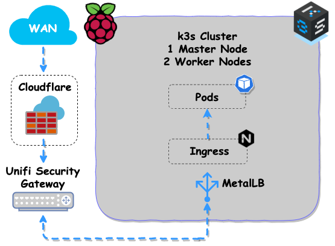

# k3s-gitops-arm

Build a [Kubernetes](https://kubernetes.io/) ([k3s](https://github.com/rancher/k3s)) cluster with RPis and utilize [GitOps](https://www.weave.works/technologies/gitops/) for managing cluster state.

> Note: A lot of files in this project have **@CHANGEME** comments, these are things that are specific to my set up that you may need to change.

I would like to give a shout-out to [k8s-gitops](https://github.com/billimek/k8s-gitops) the big brother of this repo created by [@billimek](https://github.com/billimek).

## Hardware and software

Hardware requirements for this tutorial:

- 3x RPi4 (recommended 4GB RAM) and at least 32GB SD Cards
- A NFS server for storing persistent data

Software requirements for this tutorial:

> Note: I use the fish shell for a lot of my commands. Some will work in Bash but others will not, see [here](docs/fish-shell.md) for more information.

- [ansible](https://docs.ansible.com/ansible/latest/installation_guide/intro_installation.html)
- [kubectl](https://kubernetes.io/docs/tasks/tools/install-kubectl/)
- [hypriot/flash](https://github.com/hypriot/flash)
- [alexellis/k3sup](https://github.com/alexellis/k3sup)

## Directory layout description

```bash
.
│   # Flux will only scan and deploy from this directory
├── ./deployments
│   # Initial setup of the cluster
├── ./setup
│   │   # Ansible playbook to run after the RPis have been flashed
│   ├── ./ansible
│   │   # Flash the SDCard with HypriotOS
│   └─ ./hypriotos
│   # Build flux, helm-operator, and velero for arm devices
├── ./docker
│   # Documentation
└── ./docs
```

## My network topology



|IP|Function|
|---|---|
|192.168.1.1|Router (USG)|
|192.168.1.15|Dedicated RPi running PiHole|
|192.168.1.170|NFS Server|
|192.168.42.1/24|k3s cluster CIDR, VLAN 42|
|192.168.42.23|k3s master (pik3s00)|
|192.168.42.24|k3s worker (pik3s01)|
|192.168.42.25|k3s worker (pik3s02)|
|192.168.42.26|k3s worker (pik3s03)|

## 1. Flash SDCard with HypriotOS

[HypriotOS](https://blog.hypriot.com/) is a small Operating System for the RPi, and with the help of [cloud-config](https://cloudinit.readthedocs.io/en/latest/topics/examples.html) it really makes getting your RPis online quickly and securely.

> See [hypriotos.md](docs/hypriotos.md) and review the files in the [setup/hypriotos](setup/hypriotos) folder.

## 2. Provision RPis with Ansible

[Ansible](https://www.ansible.com) is a great automation tool and here I am using it to provision the RPis.

> See [ansible.md](docs/ansible.md) and review the files in the [setup/ansible](setup/ansible) folder.

## 3. Install k3s on your RPis using k3sup

[k3sup](https://k3sup.dev) is a neat tool provided by [@alexellis](https://github.com/alexellis) that helps get your k3s cluster up and running quick.

> For manual deployment see [k3sup.md](docs/k3sup.md), and for an automated script see [bootstrap-cluster.sh](setup/bootstrap-cluster.sh)

## 4. Tiller, Helm and Flux

[Helm](https://v2.helm.sh/) is a package manager for Kubernetes and Tiller is the service that actually communicates with the Kubernetes API that manage our Helm packages. [Flux](https://docs.fluxcd.io/en/stable/) is the [GitOps](https://www.weave.works/technologies/gitops/) tool I've chosen to have this Git Repository manage my clusters state.

> For manual deployment see [tiller-helm-flux.md](docs/tiller-helm-flux.md), and for an automated script see [bootstrap-cluster.sh](setup/bootstrap-cluster.sh)

## 5. Sealed Secrets

[Sealed Secrets](https://github.com/bitnami-labs/sealed-secrets) are a "one-way" encrypted Secret that can be created by anyone, but can only be decrypted by the controller running in the target cluster. The Sealed Secret is safe to share publicly, upload to git repositories, give to the NSA, etc. Once the Sealed Secret is safely uploaded to the target Kubernetes cluster, the sealed secrets controller will decrypt it and recover the original Secret.

> See [sealed-secrets.md](docs/sealed-secrets.md) and review the files in the [setup](setup) folder.

## 6. NginX

I opted to let a HAProxy server which lives outside of my cluster handle SSL and domain routing since I have multiple domains pointing to my Homes IP address. Since every domain doesn't exactly point to my k3s cluster I found this the easy way to have any number of domains I own point to different servers in my house. See [assets/_k3s.png](assets/_k3s.png) for my network topology. This setup is documented in [docs/haproxy-cloudflare.md](docs/haproxy-cloudflare.md) if anyone is interested.

The path I have chosen above doesn't exactly fit everyones use-case so if you would like SSL terminated at NginX I would take a look at [this repo](https://github.com/billimek/k8s-gitops) and see how it's made possible with [cert-manager](https://cert-manager.io/docs/).

## 7. Minio and Velero

[MinIO](https://min.io/) is pioneering high performance object storage, think of this as self-hosted AWS S3.

[Velero](https://velero.io/) is an open source tool to safely backup and restore, perform disaster recovery, and migrate Kubernetes cluster resources and persistent volumes.

> For manual deployment see [minio-velero.md](docs/minio-velero.md)

* * *

## Opinionated RPi hardware

- [Samsung 128GB EVO Plus Class 10 Micro SDXC](https://smile.amazon.com/gp/product/B06XFHQGB9/ref=ppx_yo_dt_b_asin_title_o01_s00?ie=UTF8&psc=1)
- [AUKEY Quick Charge 3.0 6-Port USB Wall Charger](https://smile.amazon.com/gp/product/B01F20J4PE/ref=ppx_yo_dt_b_asin_title_o06_s00?ie=UTF8&psc=1)
- [AUKEY USB C Cable Short](https://smile.amazon.com/gp/product/B0746C244X/ref=ppx_yo_dt_b_asin_title_o06_s00?ie=UTF8&psc=1)
- [Cablecc Mini Size 5Gbps Super Speed USB 3.0 to Micro SD SDXC TF Card Reader Adapter](https://smile.amazon.com/gp/product/B01787LD3K/ref=ppx_yo_dt_b_asin_title_o08_s00?ie=UTF8&psc=1)
- [Samsung MUF-256AB/AM FIT Plus 256GB - 300MB/s USB 3.1 Flash Drive](https://smile.amazon.com/gp/product/B07D7Q41PM/ref=ppx_yo_dt_b_asin_title_o01_s00?ie=UTF8&psc=1)
- [Argon NEO Raspberry Pi 4 Case](https://www.argon40.com/argon-neo-raspberry-pi-4-case.html) and/or [iUniker Raspberry Pi 4 Cluster Case,](https://smile.amazon.com/gp/product/B07CTG5N3V/ref=ppx_yo_dt_b_asin_title_o03_s00?ie=UTF8&psc=1)
